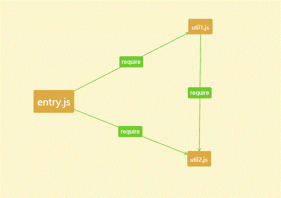
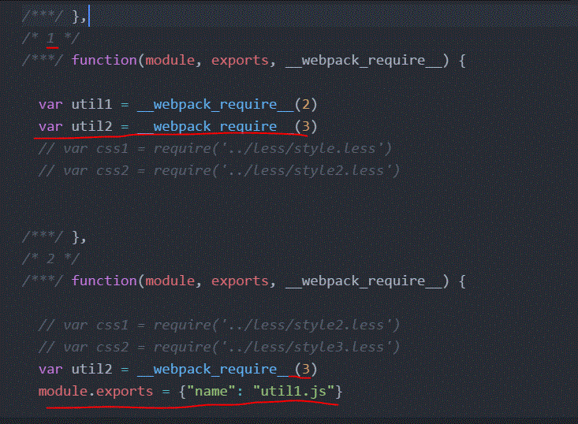

## webpack打包原理解析

一开始，对webpack打包原理很不熟悉，看了不少资料，但是讲的都不是很清楚，现在来梳理一遍。

## 所有资源统一入口

这个是什么意思呢？就是webpack是通过js来获取和操作其他文件资源的，比如webpack想处理less,但是它并不会直接从本地的文件夹中直接通过路径去读取css文件，而且通过执行入口js文件，如果入口文件中，或者入口文件相关联的js文件中含有 require(xx.less) 这个less文件，那么它就会通过对应的loader去处理这个less文件

## 打包中的文件管理

重点来了: webpack是如何进行资源的打包的呢？

### 单文件入口的情况

比如整个应用的入口为 entry.js

entry.js引用 util1.js util2.js， 同时util1.js又引用了util2.js

>关键问题是: 它打包的会不会将 util2.js打包两份？

其实不会的，webpack打包的原理为，在入口文件中，对每个require资源文件进行配置一个id, 也
就是说，对于同一个资源,就算是require多次的话，它的id也是一样的，所以无论在多少个文件中
require，它都只会打包一分

通过上面的图片我们看到，
- entry.js 入口文件对应的id为 1
- util1.js的id为 2
-  util2.js的id为 3

entry.js引用了 2 和 3, util1.js引用了 3，说明了entry和util1引用的是同一份，util2.js不会重复打包
